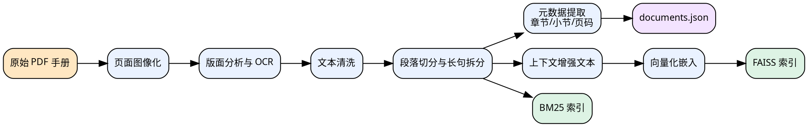

# 论文修改意见

## 1. 总体判断

这份意见聚焦本轮自查后已经确认的三类问题：

1. 否定句过多，尤其是“本文没有……而是……”“并不是……而是……”这类句式反复出现。
2. 第四章“系统实现”对“怎么实现”的展开不足，和第三章“系统设计”的写法过于接近。
3. 设计章与实现章缺少必要的过程图、状态图、时序图和实现细节图，导致文字解释压力过大。

结合 `thesis/md/chapter3_design.md`、`thesis/md/chapter4_implementation.md`、`thesis/md/chapter5_optimization.md`、`thesis/md/chapter6_testing.md` 的当前内容来看，这三个判断都成立，而且它们不是零散小问题，而是会直接影响论文气质和答辩说服力的结构性问题。

目前论文已有的图 3.1 到图 4.3 基本都属于“总体架构图、模块图、宏观流程图”。这些图能说明“系统由什么组成”，但还不足以说明“某个关键模块到底是如何实现的”。因此，后续新增图的重点不应该继续堆总体架构，而应转向离线建库流程、混合检索过程、线程协同过程、打断传播过程、文本缓冲策略等更贴近实现的内容。

## 2. 三个核心问题的具体判断

### 2.1 否定句偏多，削弱了行文的正向论证感

我对第三章到第六章做了快速统计，`没有`、`不是`、`并不`、`不再`、`不采用`、`不直接`、`并非` 这类否定表达共出现约 55 次，其中：

| 章节 | 约计出现次数 |
| --- | --- |
| `chapter3_design.md` | 14 |
| `chapter4_implementation.md` | 15 |
| `chapter5_optimization.md` | 17 |
| `chapter6_testing.md` | 9 |

这类句式少量使用并无问题，但当前频率偏高，导致论文读起来常常像在“反驳某个方案”，而不是在“论证当前方案”。最明显的风险有两个：

1. 语气容易显得拧巴，连续多个“不是……而是……”会让段落节奏发硬。
2. 论述重心容易落在“我没这么做”，而不是“我具体做了什么、这样做带来什么效果”。

第四章里这一问题最集中，尤其是下列位置：

| 位置 | 当前问题 |
| --- | --- |
| `chapter4_implementation.md:34` | “并不把全部能力外包给外部平台，而是……”属于典型的对比式否定开头 |
| `chapter4_implementation.md:50` | “并不是孤立地压缩某一个模块的耗时，而是……”仍在解释理念，未落到实现动作 |
| `chapter4_implementation.md:56` | “本项目没有把 PDF 视为简单文本源，而是……”更像设计动机，不像实现展开 |
| `chapter4_implementation.md:58` | “没有采用机械的固定长度切块，而是……”仍以否定式组织句子 |
| `chapter4_implementation.md:70` | “并不会简单选择……而是……”语气绕，且未给出实现参数 |
| `chapter4_implementation.md:92` | “并不是一次性等待……而是采用异步流式输出……”依然偏理念描述 |
| `chapter4_implementation.md:98` | “重点不是追求华丽表达，而是……”属于设计原则重述 |
| `chapter4_implementation.md:126` | “重点不是通信协议字段本身，而是……”仍然抽象 |
| `chapter4_implementation.md:132` | “不是简单地按顺序调用四个模块，而是……”与第三章几乎同构 |

建议把否定式写法改成“正向主述句 + 必要对比补句”的结构，优先遵循下面三条原则：

1. 能直接说“采用了什么”就不要先说“没有采用什么”。
2. 能直接说“实现步骤”就不要先说“设计理念”。
3. 对比句只保留在确实需要突出取舍的地方，不要把每一段都写成反向论证。

下面给出几种可直接套用的替换方式。

| 原句式类型 | 不建议继续大量使用的写法 | 更建议的写法 |
| --- | --- | --- |
| 否定对比型 | 本文没有把 PDF 视为简单文本源，而是先通过版面分析…… | 针对航空维修手册双栏、表格和页眉页脚并存的特点，本文先进行版面分析，再按区域顺序执行 OCR 与文本重组。 |
| 否定理念型 | 系统实现关注的重点并不是孤立压缩某一个模块…… | 系统实现以降低端到端首响时间为目标，具体做法是让识别、生成、合成三段尽早形成重叠。 |
| 否定职责型 | STT 模块并不直接负责用户会话决策…… | STT 模块负责输出中间识别结果与最终识别结果，会话启动、打断与后续查询调度由编排模块统一处理。 |
| 否定边界型 | 历史记录不是无上限累积，而是只保留最近若干轮…… | 历史记录采用有限窗口保留策略，当前仅保留最近若干轮问答，以兼顾上下文连续性与调用成本。 |

本轮需要在全稿中专门做一轮“否定句清理”，但不是机械替换全部“不”。更准确的做法是只重点处理以下三类句子：

1. 小节首句中的否定句。
2. 同一段中连续出现两次以上的否定对比句。
3. 本来应当写实现过程，却用“不是……而是……”包裹的句子。

### 2.2 第四章更像“设计复述”，不像“实现展开”

这是目前最需要优先处理的问题。第三章和第四章现在形成了明显的一一对应关系，这是优点；但对应过于整齐，导致第四章很多小节只是把第三章的设计意图换一种说法重讲了一遍。

第三章现在的核心特征是：

1. 解释模块职责。
2. 解释为什么这样设计。
3. 解释模块边界如何划分。

第四章本应新增的核心特征应当是：

1. 说明代码层面的入口、关键对象和调用顺序。
2. 说明实现时遇到的约束，例如线程回调、缓冲阈值、Top-K、索引文件组织等。
3. 说明关键问题是如何被具体机制解决的，而不是再次重述设计目标。

但当前第四章很多地方依然停留在“为什么这样做”上，缺少“具体怎么做”。典型例子如下。

| 位置 | 当前更像什么 | 建议改成什么 |
| --- | --- | --- |
| `4.1.2` 到 `4.1.4` | 总体架构与宏观流程复述 | 保留精简版，总字数压缩，把篇幅让给后续小节 |
| `4.2.1 文档预处理` | 设计动机说明 | 写成“页面转图 -> 版面分析/OCR -> 清洗 -> `split_by_paragraph()` -> 元数据提取”的实际流程 |
| `4.2.2 索引构建` | 能力说明 | 写清 `EmbeddingClient`、`faiss.normalize_L2()`、`IndexFlatIP`、`BM25Index.build()`、`documents.json` 的组织方式 |
| `4.2.3 混合检索与重排序` | 检索思想说明 | 写清 `fetch_k = top_k * 4`、`_dense_search()`、`_sparse_search()`、`reciprocal_rank_fusion()`、`Reranker.rerank()` 的顺序 |
| `4.3.1`、`4.3.2` | 模块职责说明 | 写清 Token 缓存、识别线程启动、回调到达、最终结果去重提交的控制点 |
| `4.4.1`、`4.4.2` | 提示与流式理念说明 | 写清 `StreamingGenerator.generate()` 如何逐片段产生文本，以及这些片段如何进入缓冲区 |
| `4.5.3` | 边界说明 | 写清 `_TtsCallback.on_data()` 如何把音频交给 `AudioBuffer.append_sync()` 并经 WebSocket 下发 |
| `4.6.1` 到 `4.6.3` | 控制中枢抽象描述 | 写清 `query_generation`、`query_lock`、`active_stt_session_id`、打断清理、音频批量发送的实现关系 |

换句话说，第四章不是不能谈“为什么”，而是每一小节必须先把“怎么实现”说出来，再在末尾补一句“这样做带来的效果是什么”。顺序不能反过来。

第四章的小节正文建议统一改造成下面这个模板：

1. 先写本小节处理的输入和输出是什么。
2. 再写实现入口在哪个文件、由哪些对象协作完成。
3. 再写关键处理步骤和约束条件。
4. 最后用 1 句话总结这样实现解决了什么问题。

下面给出几个更贴近当前项目代码实现的改写方向。

#### 4.2.1 文档预处理应增加的实现内容

建议明确写出这些实际动作，并尽量与 `src/rag/document_loader.py`、`scripts/pdf_to_txt.py` 对齐：

1. PDF 页面先转成图像，再做版面分析与 OCR。
2. 文本清洗通过 `clean_text()` 去除多余空白和异常换行。
3. 长文本切分由 `split_by_paragraph()` 完成，内部还会按句子进一步拆分过长内容。
4. `load_txt_with_metadata()` 在切分的同时提取章节、小节、页码和片段序号。

如果这里仍然只写“不是简单文本源，而是先版面分析”，答辩时很容易被继续追问“具体怎么切分、元数据怎么生成、代码上如何落地”。

#### 4.2.2 索引构建应增加的实现内容

这部分建议明确对应 `src/rag/retriever.py`：

1. `DocumentStore.add_documents()` 统一接收文档片段。
2. 向量化时优先使用 `enriched_content`，否则退回 `content`。
3. 嵌入结果经 `faiss.normalize_L2()` 归一化后写入 `faiss.IndexFlatIP`。
4. 稀疏检索索引通过 `BM25Index.build()` 基于当前全部片段重建。
5. 最终落盘内容包括 `index.faiss`、`documents.json` 和 BM25 索引文件。

这一节如果写清楚，就能把“设计”和“实现”真正分开，因为第三章不需要写这些代码级落点，第四章则必须写。

#### 4.2.3 混合检索与重排序应增加的实现内容

建议把“思想”改写成“流程”：

1. 在线检索入口为 `DocumentStore.search()`。
2. 若启用 `rerank`，会先将 `fetch_k` 扩展到 `top_k * 4`。
3. `mode = hybrid` 时，会先执行 `_dense_search()` 与 `_sparse_search()`。
4. 两路结果通过 `reciprocal_rank_fusion()` 做排序融合。
5. 若存在过滤条件，则执行 `_match_filters()`。
6. 最后调用 `Reranker.rerank()` 返回最终 Top-K。

只要把这 6 步写清楚，第四章的“实现感”会明显增强。

#### 4.3 STT 模块应增加的实现内容

建议把 `src/stt/recognizer.py` 和 `src/server/app.py` 的协同关系写出来：

1. `start_recording` 消息到达后，服务端创建新的 `StreamingRecognizer` 实例。
2. 连接建立与关闭放到 daemon 线程中执行，避免阻塞事件循环。
3. `_cb_on_result_changed()` 负责中间结果，`_cb_on_sentence_end()` 或停止逻辑负责最终结果。
4. 最终结果通过内部控制逻辑只提交一次，避免 SDK 回调与主动停止同时触发重复提交。
5. WebSocket 层用 `active_stt_session_id` 过滤失效识别结果。

这部分如果配一张时序图，文字可以少很多。

#### 4.4 LLM 模块应增加的实现内容

当前 4.4 更像“提示设计说明”，实现味道不够。建议增加：

1. `StreamingGenerator.generate()` 采用异步流式接口，逐次产出文本片段。
2. `VoiceChatPipeline.process_query()` 在接收片段后，一方面立即回传前端显示，另一方面写入 `_text_buffer`。
3. 当出现句号、问号、分号、换行，或累计长度达到 `_buffer_threshold = 15` 时，缓冲文本送入 `StreamingSynthesizer.feed_text()`。
4. 生成结束后，若缓冲区仍有残留文本，则执行一次补发，再调用 `finish()` 结束 TTS。

这里最值得写的不是“流式生成能降低等待”，而是“文本片段如何同时服务于前端显示和 TTS 合成”。

#### 4.5 TTS 模块应增加的实现内容

建议把 `src/tts/synthesizer.py` 与 `src/server/app.py` 之间的传递链条写明：

1. `StreamingSynthesizer.start()` 注册 `_TtsCallback`。
2. `_preprocess_for_tts()` 先展开航空型号中的“字母 + 数字”表达。
3. `_TtsCallback.on_data()` 在 SDK 回调线程中收到 PCM 音频。
4. 音频通过线程安全方式交给 `AudioBuffer.append_sync()`。
5. `AudioBuffer` 累积到一定字节数后统一编码并通过 WebSocket 发送 `tts_audio`。

这样写出来，第四章就会有非常明确的实现链路。

#### 4.6 会话编排模块应增加的实现内容

这一节是第四章最适合“拉开和第三章差距”的地方，建议重点展开：

1. `query_lock` 用于保证同一时刻只有一个查询主流程运行。
2. `query_generation` 用于在打断后丢弃排队中的旧查询。
3. `active_stt_session_id` 用于过滤过期 STT 回调。
4. `interrupt` 到达后，同时执行 `pipeline.interrupt()`、`audio_buffer.clear()`，并通知前端 `tts_interrupted`。
5. 查询结束后统一执行 `audio_buffer.flush()`，再发送 `tts_done`。

如果这些实现细节补上，第四章才真正能体现“实现过程”，而不是“模块职责说明”。

### 2.3 图太少，而且已有图大多停留在宏观层

当前论文里的图已经能支撑“有系统设计”，但还不足以支撑“实现过程清楚”。设计章与实现章都存在这个问题，不过第四章更明显。

目前已有图的特点是：

1. 有总架构图。
2. 有模块依赖图。
3. 有宏观时序图。
4. 没有关键实现过程图。
5. 没有状态迁移图。
6. 没有线程协同时序图。

建议新增的图，不要再重复“系统总体架构图”这类大图，而应优先补下面 6 类图：

| 建议图号 | 建议位置 | 图类型 | 主要作用 |
| --- | --- | --- | --- |
| 图 4.4 | 4.2.1 后 | 离线建库流程图 | 说明 PDF/OCR/切分/元数据/索引构建的实际步骤 |
| 图 4.5 | 4.2.3 后 | 混合检索流程图 | 说明 dense、BM25、RRF、rerank 的顺序关系 |
| 图 4.6 | 4.3.2 后 | STT 线程协同时序图 | 说明主线程、识别线程、SDK 回调之间如何协同 |
| 图 4.7 | 4.4.1 或 4.6.3 后 | 文本缓冲与 TTS 触发图 | 说明为何不是逐 token 合成，而是按缓冲阈值触发 |
| 图 4.8 | 4.5.3 后 | TTS 音频回传流程图 | 说明回调线程到 AudioBuffer 再到 WebSocket 的投递链条 |
| 图 4.9 | 4.6.3 后 | 打断传播状态图 | 说明用户打断如何同时终止 STT/LLM/TTS/音频发送 |

如果后续需要用于答辩 PPT，这 6 张图里至少有 4 张可以直接复用到展示页中，因为它们都属于“老师一眼就能看懂项目具体做法”的图，而不是只有熟悉代码细节的人才能理解的图。

## 3. 分章节修改建议

### 3.1 第三章的调整方向

第三章整体不算差，问题主要不是“写错”，而是“抽象得比较满”。建议遵循“少改总体结构，适度补图，不要和第四章抢内容”的原则。

具体建议如下：

1. `3.2.3 线程与协程混合调度模型` 可以保留，但建议增加一张简单的“主线程/阻塞线程职责划分图”，否则第四章再讲线程隔离时仍然会显得突然。
2. `3.3 模块设计` 每个模块控制在“设计目标 + 边界划分 + 为什么这么分”三句话左右，不要展开到具体实现接口。
3. `3.4 数据设计` 表 3.2 后最好再加 1 段，说明 `enriched_content` 与 `content` 的区分目的，否则字段表仍有些孤立。

第三章新增图建议不宜过多，最多补 1 到 2 张，否则会把实现章本该承担的说明压力提前拿走。

### 3.2 第四章的调整方向

第四章建议作为本轮修改重点。原则是“压缩 4.1，扩充 4.2 到 4.6”。

具体来说：

1. `4.1.2`、`4.1.3`、`4.1.4` 目前都有图，文字可以略收。
2. `4.2` 到 `4.6` 每节至少补 1 个“实现动作链条”。
3. 每个小节至少出现一次“文件/类/函数/状态”的落点，但不要堆太多裸露代码名。
4. 每个小节结尾再用 1 句话总结“这一实现解决了什么问题”。

第四章最需要避免的写法是：

1. “这一模块的重点不是……而是……”
2. “这一结构的价值不在于……而在于……”
3. “换言之……”
4. “真正重要的是……”

这些句子不是不能出现，而是当前出现太多，会把本应属于实现章节的内容重新拉回抽象设计层面。

### 3.3 第五章和第六章的联动调整方向

虽然本轮重点放在设计和实现两章，但第五章、第六章也同样受前面问题影响。

1. 第五章否定式写法也偏多，例如 `5.1.1`、`5.2.1`、`5.2.2` 基本都在用“不是单独优化某一段，而是……”这种结构，建议同步改成正向说明。
2. 第六章可以补 1 张“串行模式与流式模式时延重叠对比图”，这样第 5 章提出的优化和第 6 章的结果会对应得更强。

## 4. 建议新增图的提示词或代码草案

下面只给最值得补的 5 张图。这些图既可以直接改成 Graphviz，也可以按提示词交给绘图工具或在 PPT 中重画。

### 4.1 图 4.4 离线建库流程图

建议放置位置：`4.2.1 文档预处理` 或 `4.2.2 索引构建` 之间。

建议说明重点：

1. 原始 PDF 不是直接进入索引，而是经过页面转换、OCR、清洗、切分、元数据提取。
2. 切分结果一方面进入向量索引，另一方面进入 BM25 索引和元数据文件。

PPT/绘图提示词：

```text
绘制一张毕业论文风格的技术流程图，主题为“航空维修知识库离线构建流程”。画面采用横向流程布局，节点依次为“原始 PDF 手册”“页面图像化”“版面分析与 OCR”“文本清洗”“段落切分与长句拆分”“元数据提取”“上下文增强文本”“向量化嵌入”“FAISS 索引”“BM25 索引”“documents.json 元数据文件”。其中“段落切分与长句拆分”同时连接到“元数据提取”和“上下文增强文本”，最终形成三类产物：FAISS、BM25、documents.json。整体风格简洁、学术、适合毕业论文与答辩 PPT，配色以蓝绿灰为主，中文标签清晰。
```

Graphviz 草案：



### 4.2 图 4.5 混合检索与重排序流程图

建议放置位置：`4.2.3 混合检索与重排序` 后。

建议说明重点：

1. 查询先进入改写。
2. 改写后的查询分别进入 dense 与 sparse 两路检索。
3. 两路结果进入 RRF。
4. 融合结果进入 rerank，最后输出 Top-5。

PPT/绘图提示词：

```text
绘制一张横向技术流程图，主题为“混合检索与重排序实现流程”。节点包括“用户问题”“查询改写”“Dense 检索（FAISS）”“Sparse 检索（BM25）”“RRF 融合”“元数据过滤”“交叉编码器重排序”“Top-5 证据片段”“送入 LLM 上下文”。其中查询改写后分成两路并行检索，再汇聚到 RRF 融合。风格偏学术论文，适合直接放在毕业论文第四章。
```

Graphviz 草案：


### 4.3 图 4.6 STT 线程协同时序图

建议放置位置：`4.3.2 流式识别与线程隔离` 后。

建议说明重点：

1. 浏览器发起 `start_recording`。
2. 主事件循环创建识别器对象。
3. daemon 线程负责 `start()`。
4. SDK 回调线程持续返回中间结果和最终结果。
5. 主线程过滤失效 session，并触发后续查询。

PPT/绘图提示词：

```text
绘制一张简洁的时序图，主题为“STT 线程隔离与结果回传机制”。参与者包括“浏览器”“WebSocket 主事件循环”“StreamingRecognizer 工作线程”“NLS SDK 回调线程”“查询处理流程”。时序应体现 start_recording、音频分片上传、中间识别结果回传、最终结果去重提交、触发后续查询等关键步骤。适合论文插图和答辩讲解。
```

如果后续不准备单独画 UML 时序图，也可以直接用 PPT 画 5 列泳道图，效果会比纯文字解释好很多。

### 4.4 图 4.7 文本缓冲与 TTS 触发图

建议放置位置：`4.4.1` 或 `4.6.3` 后。

建议说明重点：

1. LLM 不是每出一个 token 就直接触发 TTS。
2. 文本先写入缓冲区。
3. 当达到标点或长度阈值时，批量送入 TTS。
4. 前端可以提前显示文本，但 TTS 只在合适粒度上触发。

PPT/绘图提示词：

```text
绘制一张机制示意图，主题为“LLM 文本缓冲与 TTS 触发策略”。上层是连续到达的文本片段，下层是缓冲区，缓冲区在“遇到句号/问号/分号/换行”或“累计长度达到阈值”时触发一次 TTS 输入。右侧标注“前端文本显示即时更新”“TTS 按句或按阈值分批合成”。整体风格适合论文第四章实现细节说明。
```

### 4.5 图 4.8 打断传播状态图

建议放置位置：`4.6.3 文本缓冲、音频批量发送与打断控制` 后。

建议说明重点：

1. 用户打断不是单点动作，而是一个全链路状态传播过程。
2. 打断后要终止旧查询、清空文本缓冲、取消 TTS、清空音频缓冲、通知前端。

PPT/绘图提示词：

```text
绘制一张状态传播图，主题为“语音打断机制的全链路失效传播”。中心节点为“用户打断/新输入到达”，向外辐射到“query_generation 增加”“旧 STT 结果失效”“LLM 停止继续消费”“TTS cancel”“AudioBuffer clear”“前端收到 tts_interrupted”。风格清晰、简洁、适合答辩 PPT 单页展示。
```

## 5. 推荐修改顺序

下一轮正式改正文时，建议按下面顺序推进：

1. 先清第四章的小节结构，把“设计复述”改成“实现过程说明”。
2. 再做全文否定句清理，重点处理第三章到第六章的小节首句。
3. 然后补图，优先补图 4.4、图 4.5、图 4.6、图 4.8。
4. 最后再联动修第五章和第六章，使“优化”和“测试结果”与新增实现图呼应。

如果时间有限，最值得优先做的不是全稿润色，而是下面四件事：

1. 重写 `4.2.1` 到 `4.6.3` 的正文组织方式。
2. 把第四章里高频“不是……而是……”改成正向实现描述。
3. 新增“混合检索流程图”和“打断传播状态图”。
4. 在第六章补一张“串行模式与流式模式时延对比图”。

## 6. 一句话结论

当前论文最大的问题，不是“内容不够”，而是“实现写得还不够像实现，很多段落仍在用设计和取舍语言说话”。只要第四章改成真正的实现过程说明，再配上 4 到 6 张关键机制图，整体质量就会明显上一个台阶。
