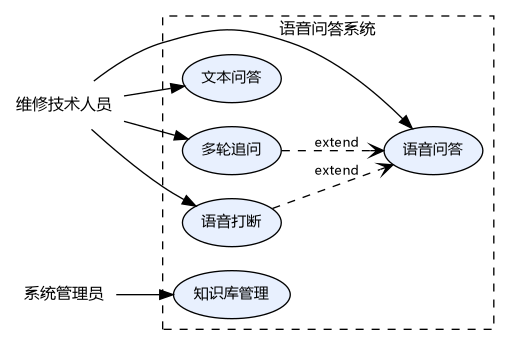
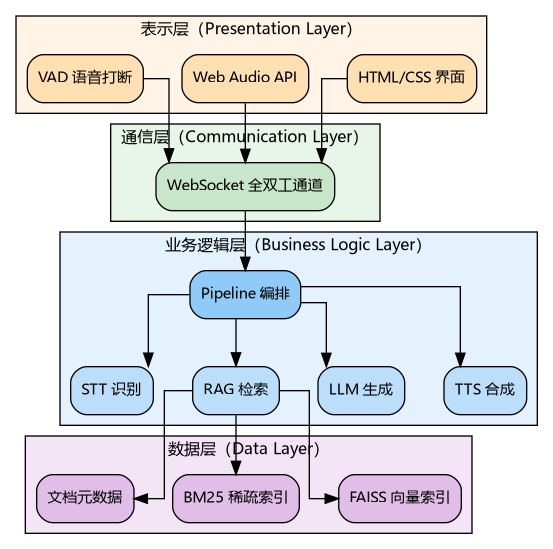
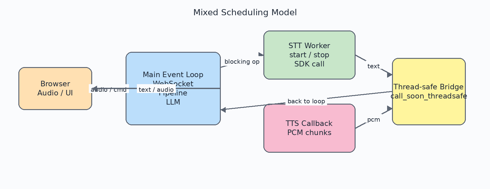

# 第三章 系统需求分析与设计

本章围绕语音问答项目的实际应用目标展开分析。在明确功能需求和性能约束的基础上，本文进一步给出整体架构、模块边界和数据组织方式，使后续实现章节能够与设计章节逐项对应，避免出现设计与实现脱节的问题。

## 3.1 需求分析

### 3.1.1 功能需求

本项目面向航空维修技术人员，目标是在复杂作业环境下提供可追溯、可打断、低延迟的语音问答能力。与一般开放域问答不同，航空维修场景要求回答内容必须基于手册和技术资料，既要保证检索准确性，也要保证交互过程足够自然。因此，项目的功能需求并不是若干孤立功能的简单堆叠，而是围绕一次完整问答闭环展开。

首先，项目需要具备稳定的语音输入能力。维修人员往往无法在工作现场频繁切换到键盘输入，因此系统应支持持续监听和按住说话两种录音模式，并能够在录音过程中持续返回中间识别结果，使用户及时判断识别内容是否偏离原意。其次，项目需要建立基于知识库的回答生成能力。用户提出问题后，系统不仅要生成回答，还必须展示对应的文档来源，从而满足航空维修场景对依据可核验的要求。

进一步来看，项目还应支持实时播报和交互打断。维修人员在听到回答后，往往会立即追问、补充条件或终止当前播报，因此系统需要在播放过程中接受新的输入，并快速停止旧回答。此外，多轮对话能力也是本项目的重要功能之一，因为许多实际提问会使用“它”“这个部件”“上一条提到的检查项”等代词表达，系统若不能结合历史上下文，就难以完成正确检索。最后，考虑到部分场景下语音并不方便使用，项目还需要保留文本输入能力，并把每轮问答的检索来源、章节和页码展示给用户，以便人工复核。

### 3.1.2 非功能需求

除功能层面的要求外，本项目还受到明显的非功能约束。首先是实时性约束。语音问答的交互体验高度依赖响应速度，若用户说完问题后需要等待数秒才能听到回答，系统就很难在现场作业中真正发挥辅助作用。因此，本项目将“说完到听到首段回答”的端到端延迟控制在 2 秒左右作为核心性能目标。

其次是准确性约束。由于航空维修属于安全敏感场景，回答是否正确比回答是否流畅更重要。为此，项目不仅要求大语言模型输出自然，还要求检索模块在 Top-5 结果范围内尽可能命中正确知识片段，以确保生成内容建立在可靠证据之上。再次是可靠性与可扩展性要求。系统在网络抖动、云服务短暂异常或用户中途打断时，不能直接崩溃，而应具备清晰的状态切换和异常处理机制；同时，项目应允许后续替换语音识别、语言模型或知识库内容，而不需要整体重构。

最后，本项目还需要满足易用性要求。前端界面不宜包含过多操作步骤，语音录制、文本输入、来源查看和打断控制都应保持直观，避免维修人员在使用过程中将注意力转移到界面操作本身，而不是当前维修任务。

### 3.1.3 用例分析

在上述需求基础上，可以将本项目抽象为若干核心使用场景。系统用例关系如图 3.1 所示，图中区分了维修技术人员与系统管理员两类参与者，前者关注日常问答过程，后者负责知识库更新与维护。

为了避免用例分析停留在流程罗列层面，本文将主要场景归纳为表 3.1 所示的四类核心用例。该表关注每个用例的触发条件与目标结果，而不是把具体交互过程写成说明书式操作步骤。

表 3.1 核心用例分析

| 用例编号 | 用例名称 | 主要参与者 | 触发条件 | 目标结果 |
| --- | --- | --- | --- | --- |
| UC-1 | 语音问答 | 维修技术人员 | 用户开始录音并提出维修问题 | 系统返回文本答案、语音播报及检索来源 |
| UC-2 | 文本问答 | 维修技术人员 | 用户在输入框中直接输入问题 | 系统返回文本答案并同步播报 |
| UC-3 | 多轮追问 | 维修技术人员 | 用户在已有问答基础上继续追问 | 系统结合历史语境理解代词、省略和补充条件 |
| UC-4 | 知识库更新 | 系统管理员 | 新增维修手册或修订资料需要导入 | 文档文本完成提取、切分和索引重建 |

从表 3.1 可以看出，语音问答是本项目的核心用例，因为它直接体现了“语音输入、知识检索、答案生成、语音播报”这一完整闭环。文本问答虽然交互形式较为简单，但它承担了调试、补充输入和噪声环境兜底的作用。多轮追问则体现了项目的上下文理解能力，决定系统是否能够从一次性问答工具提升为连续对话工具。知识库更新看似不直接参与运行时交互，但它决定了项目能否持续接入新的维修资料，因而是工程落地不可缺少的支撑用例。

因此，后续设计不应把所有功能平均对待，而应优先围绕 UC-1 和 UC-3 建立模块协作关系，再以 UC-2 和 UC-4 作为补充支撑。这也是后文在模块设计中突出 RAG、语音识别、语音合成和会话编排的主要原因。

## 3.2 系统总体架构设计

### 3.2.1 系统架构概述

本项目采用浏览器访问的 B/S 架构，整体可以划分为表示层、通信层、业务逻辑层和数据层四个层次，如图 3.2 所示。表示层负责采集用户音频、展示识别与回答结果，并播放返回语音；通信层负责建立前后端双向长连接，使音频上传与文本、音频下行能够在同一连接中并发进行；业务逻辑层承担语音识别、检索增强生成、语言模型推理、语音合成和会话编排等核心任务；数据层则负责知识库文档、索引文件和评估数据的持久化管理。

这种分层方式的目的不在于形式上的结构清晰，而在于把“用户交互”“实时传输”“业务处理”“数据支撑”四类职责分开。只有先在设计阶段明确层级边界，后续实现时才不会把前端状态控制、后端消息接入和模型调用逻辑混杂在一起。

### 3.2.2 端到端流式架构

与传统串行问答不同，本项目采用端到端流式处理方式。其核心思想不是等待某一阶段完全结束后再启动下一阶段，而是允许识别、生成和播报尽早重叠执行，从而缩短用户感知到的等待时间。整体数据流如图 3.3 所示。

在该架构下，浏览器持续上传音频分片，语音识别模块在收到音频后逐步给出中间文本和最终文本；最终文本一旦形成，即可触发检索和语言模型生成；语言模型输出的文本片段不必等待完整回答结束，而是可以按一定粒度送入语音合成模块继续生成音频。正是由于这些阶段在时间上产生了重叠，系统才能将原本串行叠加的等待时间压缩到可接受范围内。

### 3.2.3 线程与协程混合调度模型

流式架构的实现离不开合理的调度模型。后端根据组件特性采用协程与线程混合调度：浏览器连接管理、消息收发、语言模型调用和会话编排属于典型的异步 I/O 任务，适合运行在事件循环中；第三方语音识别与语音合成 SDK 则包含阻塞连接、内部回调线程等特性，需要通过独立线程与主流程隔离。图 3.4 给出了这一调度关系。

基于这一现实约束，本项目在设计阶段就将“异步业务流程”和“阻塞式 SDK 调用”分开处理。主线程主要负责会话状态维护和异步调度，阻塞操作则放在独立线程中执行，再通过线程安全的调度接口把结果交还给主事件循环。这样的设计一方面保留了异步模型在高并发消息处理上的优势，另一方面也使后续实现阶段能够围绕“线程产生结果、协程统一编排”这一思路展开。

## 3.3 模块设计

为了保证系统设计与系统实现能够一一对应，本文按照业务职责与控制边界将项目划分为 RAG 检索模块、STT 语音识别模块、LLM 推理模块、TTS 语音合成模块以及会话编排与服务接入模块五个核心模块。其中，浏览器通信接入、会话状态维护、消息调度与打断控制统一归入会话编排与服务接入模块。后续第四章也将按同样顺序展开实现分析。

### 3.3.1 RAG 检索模块

RAG 检索模块的任务是把用户问题转换为可供生成模型使用的高质量上下文。对于航空维修场景而言，仅依赖大语言模型已有知识难以保证回答的准确性和可追溯性，因此检索模块实际上承担了“提供证据”的职责。该模块既要完成知识库文档的切分、向量化和索引构建，也要在运行时完成查询改写、候选召回、结果融合和重排序。

从结构上看，该模块由文档加载、向量化、稀疏检索、重排序和查询改写等若干子能力组成。在设计上，更重要的不是具体内部对象如何命名，而是这些能力之间的协作关系：查询改写负责把口语化表达转化为更适合检索的查询文本，稠密检索负责捕获语义相似性，稀疏检索负责强化术语与编号匹配，重排序负责在候选结果中进一步提升排序质量。

因此，RAG 模块的关键设计并不是选择某一个单独算法，而是构建“改写、召回、融合、重排”这一完整检索链路。这样做的原因在于，航空维修问答同时具有专业术语密集和用户表达口语化两种特点，单一路径往往只能解决其中一类问题，而组合式检索链路更适合当前场景。

### 3.3.2 STT 语音识别模块

STT 语音识别模块承担从语音到文本的实时转换任务，是后续检索和回答生成的起点。该模块不仅要求识别精度较高，还要求能够在用户讲话过程中不断返回中间结果，使前端界面及时更新状态，并在用户结束讲话后尽快产出稳定的最终文本。

考虑到第三方语音识别服务通常采用长连接和回调式处理模式，本项目在设计该模块时重点关注两个问题：一是如何管理鉴权状态，避免长时间运行后 Token 失效；二是如何避免阻塞式连接建立和关闭操作影响后端主流程。为此，该模块在结构上区分了 Token 管理能力与流式识别能力，前者负责鉴权有效期控制，后者负责音频送入、识别回调接收和最终结果提交。

在整体架构中，STT 模块并不直接负责用户会话决策，而是把识别到的中间结果和最终结果交给会话编排模块处理。这样的边界划分使语音识别模块保持单一职责，便于后续替换语音服务或调整识别参数。

### 3.3.3 LLM 推理模块

LLM 推理模块负责结合检索结果生成最终回答。在本项目中，语言模型并不是独立作答，而是在检索结果约束下完成面向语音播报的回答生成。因此，该模块的设计重点不只是调用某个模型接口，更在于如何构造适合语音场景的提示上下文，以及如何以流式方式输出文本片段。

从设计目标上看，LLM 模块需要同时满足三项要求：第一，回答必须尽量建立在检索证据之上，而不是自由发挥；第二，回答长度应适合语音播报，避免输出过长、结构过碎或包含不适合朗读的格式；第三，模型输出要能够以增量方式交给下游语音合成模块，以配合整体流式链路。

因此，LLM 模块在设计上被定位为“受检索上下文约束的流式回答生成器”。在实现层面虽然会使用特定的客户端对象和消息结构，但在系统设计层面，更关键的是明确它与 RAG 模块和 TTS 模块的连接关系：前者负责提供事实依据，后者负责把增量文本及时转换为语音输出。

### 3.3.4 TTS 语音合成模块

TTS 语音合成模块负责把语言模型输出的文本转化为可播放的语音。与传统文本播报不同，本项目中的语音合成需要直接接入实时问答流程，因此它不能只关注最终音质，还必须兼顾首包时延、分段自然度和中途取消能力。

基于这一点，TTS 模块在设计时重点处理两类问题。一类是语音播报自然度问题，例如航空型号、章节编号和数字串如果直接照文本发音，往往会与维修人员的专业表达习惯不一致，因此在送入合成前需要进行一定的文本预处理。另一类是并发协同问题，即语音合成结果来自 SDK 回调线程，而最终播放数据需要由主流程继续下发给前端，这要求模块具备稳定的跨线程数据投递能力。

因此，TTS 模块被设计为一个既承担文本预处理又承担流式音频回传的模块，它既要和 LLM 模块保持紧密衔接，又要服从会话编排模块关于打断、完成和状态切换的统一控制。

### 3.3.5 会话编排与服务接入模块

会话编排与服务接入模块是本项目的控制中枢，其职责是把前端接入、状态维护、消息调度和各核心业务模块串联成一条可运行的交互链路。在这一模块中，WebSocket 负责承载浏览器与后端之间的实时双向通信，会话编排逻辑则负责决定何时启动识别、何时触发检索、何时推动合成、何时接受打断以及何时更新历史上下文。

在这一模块中，服务接入部分负责处理浏览器与后端之间的双向通信，把音频、文本和控制命令交给后端会话；会话编排部分则负责维护当前问答状态，协调 STT、RAG、LLM 和 TTS 四个核心模块按顺序或并行方式工作。通信通道只是外部入口，真正的设计重点在于后端如何建立面向单次问答和多轮追问的统一控制流程。

这一模块还需要承担音频批量发送、历史记录维护和打断传播等任务。只有把这些控制能力统一收拢到会话编排与服务接入模块中，系统设计与系统实现才能保持一致，第四章也才能与本章模块划分一一对应。

## 3.4 数据设计

### 3.4.1 文档数据结构

知识库文档是本项目最重要的基础数据。每个文档片段除了保存原始文本内容外，还需要记录来源文件、章节名称、页码和片段序号等元数据，以便后续在检索命中后向用户展示依据来源。对于采用上下文增强策略的片段，还需要额外保存增强后的文本内容，使向量化阶段能够利用更完整的语境信息。

表 3.2 给出了文档片段的核心字段设计。

表 3.2 文档片段核心字段

| 字段 | 含义 |
| --- | --- |
| `content` | 文档片段的原始文本内容 |
| `enriched_content` | 拼接上下文后的增强文本 |
| `source` | 来源文件名或路径 |
| `chapter` | 所属章节标题 |
| `section` | 所属小节编号 |
| `page` | 来源页码 |
| `chunk_index` | 片段在原文中的顺序编号 |

### 3.4.2 索引数据结构

为了同时支持稠密检索和稀疏检索，项目运行时需要维护向量索引、BM25 索引及其配套元数据文件。向量索引用于保存片段嵌入表示，BM25 索引用于保存分词结果和稀疏检索模型，文档元数据则用于把检索结果还原为用户可理解的来源信息。这样设计的好处在于，各类检索能力可以共享同一套文档片段定义，但在运行时又能按各自最合适的结构独立组织。

除了离线索引文件外，会话处理过程中还需要维护历史问答记录、当前连接状态和打断状态等运行时数据。这些数据不需要长期持久化，但它们直接影响多轮对话、并发控制和旧请求失效处理，因此同样属于系统设计必须提前考虑的数据对象。

### 3.4.3 评估数据结构

为了验证检索模块优化前后的效果，本项目构建了独立的评估数据集。每条评估样本至少包括测试查询、标准答案片段以及标准答案所属来源文档。通过这种设计，评估过程既可以度量系统是否命中正确内容，也可以在知识库扩充或切分策略调整后继续复用原有测试集。

与运行时数据不同，评估数据的设计目标并不是直接参与问答过程，而是为第五章和第六章中的实验分析提供稳定依据。因此，它在整体系统中的角色更接近“验证基准”，而不是“业务输入”。

## 3.5 本章小结

本章首先从功能需求和非功能需求两方面明确了语音问答项目的设计目标，随后给出了四层总体架构、端到端流式处理思路以及协程与线程混合调度模型。在此基础上，本文将系统统一划分为 RAG 检索、STT 语音识别、LLM 推理、TTS 语音合成和会话编排与服务接入五个核心模块，并说明了文档、索引和评估数据的组织方式。这样的划分方式将直接映射到第四章的系统实现，从而保证设计章节与实现章节的一一对应关系。
