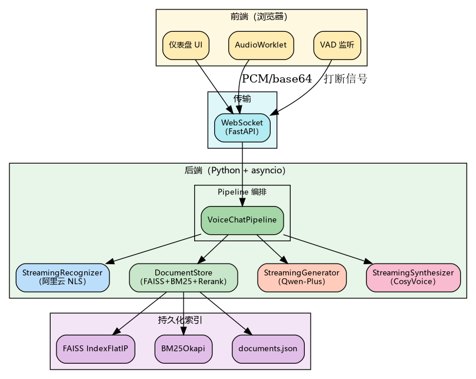
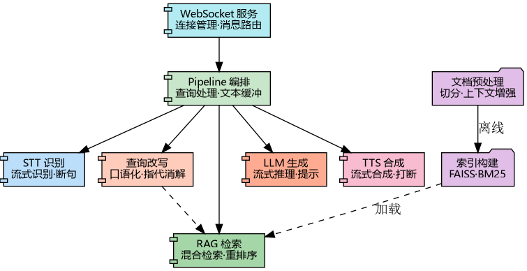
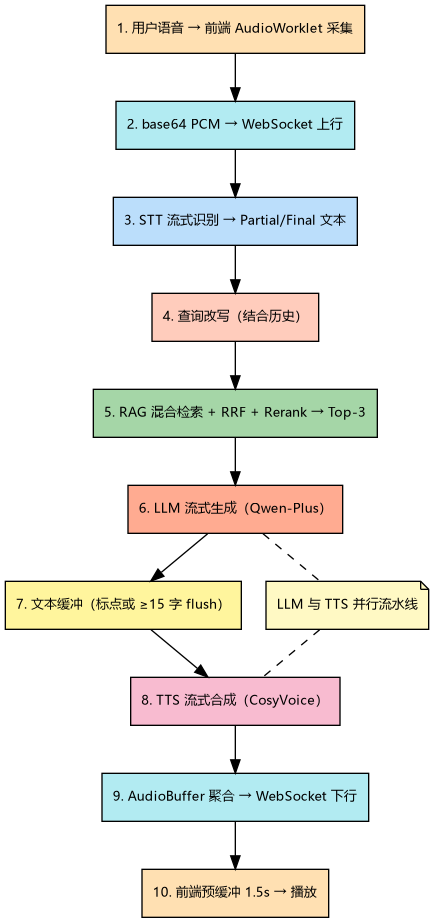

# 第四章 系统实现

本章在第三章设计方案的基础上，说明项目的具体实现方式。为了保证结构一致性，本文仍然按照 RAG 检索模块、STT 语音识别模块、LLM 推理模块、TTS 语音合成模块以及会话编排与服务接入模块五个部分展开，而不再把通信机制单独视为一个与核心业务模块并列的系统模块。

## 4.1 系统总体实现

### 4.1.1 开发环境与技术选型

本项目以后端 Python 3.10 与前端原生 JavaScript 为主要开发环境，核心目标是在保持工程结构简洁的前提下，完成面向语音问答场景的实时交互链路。后端选择异步友好的 Web 服务框架，主要是因为其便于承接浏览器长连接、流式模型调用以及跨模块回调协同。前端不引入额外框架，而是直接使用浏览器原生能力完成录音、播放与状态展示，这样既能减少不必要的工程复杂度，也更便于精细控制音频处理过程。

表 4.1 给出了实现环境与关键依赖。与传统 Web 应用不同，本项目的依赖选择不仅取决于通用开发效率，还受到流式语音、文档处理和检索增强三类任务的共同影响。例如，OCR 与版面分析相关依赖用于复杂文档抽取，向量检索与稀疏检索相关依赖用于混合检索，而模型接口相关依赖则承担语言模型、向量化、重排序与语音合成能力调用。

表 4.1 实现环境与关键依赖

| 类别 | 名称 | 版本或说明 | 用途 |
| --- | --- | --- | --- |
| 操作系统 | Ubuntu（WSL2） | 22.04 | 开发与测试环境 |
| 后端语言 | Python | 3.10 | 后端服务与脚本实现 |
| Web 框架 | FastAPI | 0.104+ | 浏览器接入与异步服务 |
| ASGI 服务器 | uvicorn | 0.24+ | 本地运行与调试 |
| 向量检索 | faiss-cpu | 1.7.4+ | 稠密向量检索 |
| 稀疏检索 | jieba + rank_bm25 | 0.42 / 0.2 | 中文分词与 BM25 检索 |
| 文档处理 | paddlepaddle + paddleocr | 3.0.0 / 3.4.3 | PDF 文字提取与 OCR |
| 模型接口 | openai + dashscope | 1.12+ / 1.17+ | LLM、Embedding、Rerank、TTS |

在云服务选择方面，本项目将语音识别、语言模型、向量化、重排序和语音合成都接入阿里云相关服务体系。一方面，这些服务在中文场景中具有较好的可用性；另一方面，统一在同一生态内接入也有利于减少跨平台适配成本。对毕业设计而言，这种技术选型能够在实现效率、接口稳定性和实验可复现性之间取得较好的平衡。

### 4.1.2 系统总体架构

系统总体架构如图 4.1 所示。浏览器前端负责录音、文本输入、状态展示与语音播放；后端服务负责会话状态控制、业务模块调度和模型接口组织；云端服务负责语音识别、语言模型推理、向量化和语音合成等能力输出。知识库索引和文档元数据保存在本地，避免每轮问答都依赖远程知识检索。

这一架构安排体现了本项目“本地掌控知识、云端提供模型”的实现思路。具体而言，项目并不把全部能力外包给外部平台，而是把决定回答依据的知识库和检索逻辑保留在本地，通过本地检索结果约束云端语言模型生成，从而兼顾了工程可实现性与专业场景对可追溯性的要求。

### 4.1.3 模块划分与功能职责

后端实现遵循第三章给出的五模块划分方式，模块依赖关系如图 4.2 所示。检索模块负责文档加载、索引构建和在线检索，语音识别模块负责识别过程与鉴权状态管理，语言模型模块负责受检索上下文约束的回答生成，语音合成模块负责流式音频输出，而会话编排与服务接入模块则共同承担浏览器接入、状态维护和模块协同职责。

值得强调的是，浏览器接入层并不是一个与检索、识别、生成、合成并列的“业务模块”，而是为前端提供接入入口和会话承载能力；它与会话编排逻辑共同组成实现层面的控制中枢。这种划分方式与第三章的设计完全一致，因此后续实现叙述能够做到逐项映射，而不会出现设计一套、实现另一套的问题。

### 4.1.4 端到端处理流程

一次完整语音问答的处理流程如图 4.3 所示。用户在浏览器端启动录音后，前端会持续上传音频分片；后端收到稳定的最终识别文本后，启动检索增强生成流程；语言模型一旦输出足够长度的文本片段，即可继续触发语音合成；合成得到的音频数据再按流式方式返回浏览器并播放。

这一流程的关键不在于模块顺序本身，而在于多阶段之间存在尽可能多的时间重叠。换言之，系统追求的不是“每个模块都最快”，而是“整条链路的用户感知延迟最小”。正因为如此，后文各模块的实现都会围绕“减少等待”和“保持可中断性”展开。

## 4.2 RAG 检索模块实现

### 4.2.1 文档预处理

航空维修资料通常包含双栏排版、图表说明、编号列表和复杂页眉页脚，如果直接采用通用文本提取工具，往往会出现阅读顺序错乱、表格内容丢失或章节边界模糊等问题。针对这一特点，本项目没有把 PDF 视为简单文本源，而是先通过版面分析识别页面区域，再结合 OCR 提取文字内容。具体处理过程中，系统先将页面转化为图像，再按版面区域顺序组织文字结果，以提高复杂文档的可读性和后续切分质量。

完成文本抽取后，项目进一步实现文档切分逻辑。这里没有采用机械的固定长度切块，而是优先遵循自然段落边界，再对过短段落进行合并、对过长段落按句子或字符长度进一步拆分。之所以采用这种策略，是因为维修手册中的技术要点往往以段落为基本语义单元，如果在切分时破坏原有段落结构，就会直接影响后续检索结果的可用性。

在切分过程中，系统还会同步提取章节标题、小节编号和页码等元数据。这些元数据既用于后续来源展示，也为带有章节约束或页码约束的检索提供了结构化支持。

### 4.2.2 索引构建

知识库索引构建采用统一的离线流程调度。对每个文档片段，系统首先生成用于稠密检索的向量表示，并进行归一化处理后写入向量索引；在中文稀疏检索方面，系统完成分词后再利用 BM25 模型保存词项统计信息。与只保留单一索引文件的做法不同，本项目会同时保存向量索引、文档元数据以及稀疏检索相关文件，使系统启动后能够直接恢复完整检索能力。

这种索引组织方式的实现重点不在于文件数量多少，而在于把“召回能力”和“来源可追溯能力”同时保留下来。向量索引负责提高语义检索能力，BM25 索引负责强化术语精确匹配，而文档元数据则负责把命中的片段重新组织成用户可理解的来源信息。三者只有同时存在，RAG 才能既“找到内容”又“解释内容来自哪里”。

### 4.2.3 混合检索与重排序

在线检索阶段，项目并不会简单选择“稠密检索”或“稀疏检索”中的某一路结果，而是先在查询改写后并行执行两类召回，再利用倒数排名融合方法整合候选排序。之所以采用这种方式，是因为航空维修问答既包含口语化表达，也包含大量型号、章节号和专业术语，单一路径很难同时兼顾语义泛化与精确匹配。

在召回阶段之后，系统还会继续调用重排序模型对候选片段做二次筛选。实现中，检索模块会为最终返回的 Top-5 结果准备更大的候选集合，再通过交叉编码器从中筛选出排序更优的片段。这样做虽然增加了一次额外模型调用，但换来的好处是语言模型接收到的上下文更加集中、更少噪声，从整体上提升了最终答案质量。

## 4.3 STT 语音识别模块实现

### 4.3.1 NLS Token 管理

语音识别服务采用动态 Token 鉴权机制，因此系统必须在长时间运行过程中维护有效的身份凭证。为此，系统将鉴权状态管理从识别流程中单独拆出，用于缓存当前 Token 及其过期时间。当新的识别会话启动时，系统会优先检查已有 Token 是否仍处于安全有效期内；若剩余有效时间不足，则重新向服务端申请新的 Token。

将 Token 管理从识别流程中单独抽离，有两个直接好处。第一，识别会话本身无需关心鉴权刷新细节，可以保持职责单一；第二，后续即使需要更换鉴权策略，也不会影响识别回调和音频传输逻辑。对于需要持续运行的语音问答服务而言，这样的分层处理比把鉴权逻辑散落在每次识别调用中更稳定。

### 4.3.2 流式识别与线程隔离

流式识别模块负责启动识别会话、持续送入音频分片、接收中间结果和最终结果，并在用户结束讲话后及时关闭当前识别过程。由于第三方识别服务的连接建立、停止和回调处理包含阻塞式行为，如果直接放在事件循环中，会影响其他异步任务的执行，因此项目采用独立线程承接这些阻塞操作。

在实现层面，系统还特别处理了最终识别结果重复提交的风险。实际运行中，SDK 回调和主动停止操作可能几乎同时到达，如果不做额外控制，就可能把同一句话重复交给后续流程。为了解决这一问题，模块内部增加了线程安全的结果交付控制逻辑，确保一轮语音输入只产生一次有效最终文本。这样做虽然增加了少量状态管理开销，但能显著提升整条链路的稳定性。

## 4.4 LLM 推理模块实现

### 4.4.1 流式生成实现

在语言模型实现阶段，系统并不是一次性等待完整回答生成结束后再统一处理，而是采用异步流式输出方式，把模型逐步生成的文本片段持续交回主流程。这样设计的原因在于，本项目的最终输出形式是语音播报，如果必须等到完整回答结束后才能继续处理，就会显著增加用户等待时间。

流式生成的另一个价值在于它天然适合接入打断控制。只要会话编排模块发现当前回答已失效或用户发起了新的提问，就可以在主流程中停止继续消费后续文本片段，从而避免旧回答继续向下游传播。对于语音交互项目而言，这种可中断性与首段时延一样重要。

### 4.4.2 提示模板设计

本项目中的语言模型并非面向通用聊天场景，而是服务于专业问答与语音播报场景。因此，提示模板设计的重点不是追求华丽表达，而是控制回答边界、保证输出可朗读并减少无依据扩展。系统提示会明确要求回答内容以检索证据为依据，回答长度保持克制，并在涉及安全关键操作时提醒用户以官方维修手册为准。

此外，检索片段会作为结构化参考内容注入模型上下文，而历史对话则作为多轮追问的语义补充。这样的输入组织方式使语言模型既能利用当前问题，也能结合上文语境，从而更好地适应“上一条说的检查项”“这个部件还要注意什么”等多轮提问场景。

## 4.5 TTS 语音合成模块实现

### 4.5.1 双向流式合成

语音合成模块采用双向流式合成能力。与一次性把全文提交给合成服务相比，双向流式模式允许系统分批送入文本，并持续接收回传音频帧。这一机制与前文所述的流式语言模型输出天然匹配，因此能够构成“边生成、边合成、边回传”的连续处理链路。

从实现结果看，合成模块返回的是 22050 Hz 单声道 PCM 音频数据。虽然这一细节属于底层实现参数，但它对前端播放调度、缓冲长度和音频拼接方式都会产生直接影响，因此在系统实现中必须作为一项明确的技术约束加以处理。

### 4.5.2 航空型号数字预处理

航空维修场景中存在大量型号、部件号和编号表达，例如机型代号、检查项目编号和章节序号。如果直接将这些文本送入合成模型，往往会出现不符合专业口语习惯的读法。为此，本项目在送入语音合成前增加了文本预处理步骤，对常见“字母 + 数字”组合进行展开，使合成结果更贴近维修人员实际交流习惯。

这一步预处理看似是细节优化，实际上直接关系到用户对系统专业性的感知。如果回答内容在事实层面正确，但关键型号读法不自然，用户仍然会对结果可信度产生疑虑。因此，文本预处理被纳入 TTS 模块本身，而不是交给前端或后处理阶段临时修补。

### 4.5.3 跨线程音频投递

语音合成 SDK 的音频回调并不运行在主事件循环中，而是由其内部 I/O 线程主动触发。与此同时，浏览器下行消息发送仍然由主流程统一控制。为保证音频数据能够稳定回传，项目在 TTS 模块内实现了跨线程投递机制：回调线程负责把音频片段安全转交给后端主流程，主流程再将其组织为适合前端消费的数据格式并继续下发。

这一实现方式保证了“多线程产生音频、单线程组织发送”的边界清晰性。相比直接在回调线程中处理网络发送，它更有利于统一异常处理、状态判断和打断控制，也更符合整个项目的会话编排逻辑。

## 4.6 会话编排与服务接入模块实现

### 4.6.1 会话建立与消息接入

服务接入层通过统一的 WebSocket 端点接收浏览器上传的音频分片、文本问题和控制指令，并为每个连接维护独立的会话状态。这里的重点不是通信协议字段本身，而是如何把浏览器行为映射成后端的一次次有效问答事件。例如，开始录音、结束录音、直接文本提问和中途打断，在实现层面虽然表现为不同消息类型，但在系统语义上都属于会话状态变化。

因此，本项目并没有把 WebSocket 单独作为一个独立业务模块，而是把它视为会话接入方式，由服务接入层承接外部输入，再交给会话编排逻辑统一处理。这样做的好处是，浏览器通信细节不会反向污染核心业务模块，识别、检索、生成和合成模块都可以保持相对独立。

### 4.6.2 查询编排与上下文维护

会话编排模块负责在识别结果稳定后启动查询改写、知识检索、语言模型生成和语音合成，并把各阶段产生的中间结果交给前端展示或播放。从控制逻辑看，这一模块不是简单地“按顺序调用四个模块”，而是要根据会话状态决定何时开始、何时停止以及何时丢弃已经失效的旧结果。

为了支持多轮对话，编排模块还维护有限长度的历史问答记录。历史记录不是无上限累积，而是只保留最近若干轮上下文，以便在追问场景下补充语义信息，同时避免上下文过长导致模型调用成本过高。通过这种方式，项目既保留了连续对话能力，也控制了工程实现复杂度。

### 4.6.3 文本缓冲、音频批量发送与打断控制

在流式链路中，若把语言模型输出的每个极短文本片段都立即送入语音合成模块，往往会造成发音破碎；但若等待整段回答完全生成后再统一合成，又会失去流式处理带来的实时性优势。针对这一矛盾，编排模块在语言模型与语音合成之间引入文本缓冲机制：当文本片段达到一定长度，或遇到明显句读停顿时，再把当前缓冲内容送入合成模块。这样既能保证较快的首段响应，也有助于提升合成语音的自然度。

在音频下行阶段，服务接入层还增加了音频批量缓冲能力。由于语音合成回调产生的音频片段通常较小，若逐片发送，会带来较高的消息频率和前端处理开销。因此，系统会先在后端将多个小片段合并，再以较稳定的批次发送给浏览器，以降低通信负担。

打断控制则是本模块实现中的另一项重点。用户在播报过程中发起新的输入后，系统需要同时终止旧的语言模型输出、停止旧的语音合成、清空未发送音频，并使浏览器状态切回可接收新问题的模式。正因为这些动作横跨多个模块，打断能力必须由会话编排与服务接入模块统一协调，而不能寄希望于某个单一子模块独立完成。

## 4.7 本章小结

本章围绕第三章提出的五模块设计，依次说明了项目的具体实现方式。RAG 检索模块通过版面分析、OCR、文档切分、混合检索与重排序构建可靠的知识支撑；STT 模块通过鉴权管理与线程隔离实现稳定的实时识别；LLM 模块通过受上下文约束的流式生成形成可播报回答；TTS 模块通过双向流式合成、文本预处理和跨线程投递完成语音输出；会话编排与服务接入模块则把浏览器接入、状态维护、文本缓冲、音频批量发送和打断控制统一组织起来。至此，系统设计中的模块边界已经在实现层面得到完整对应，为后续优化和测试分析奠定了基础。
