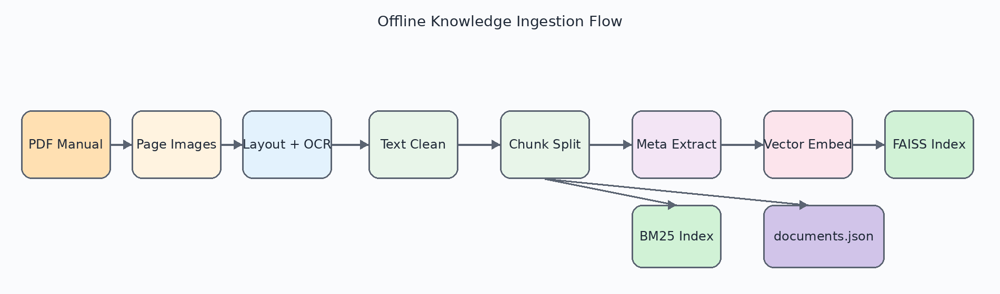
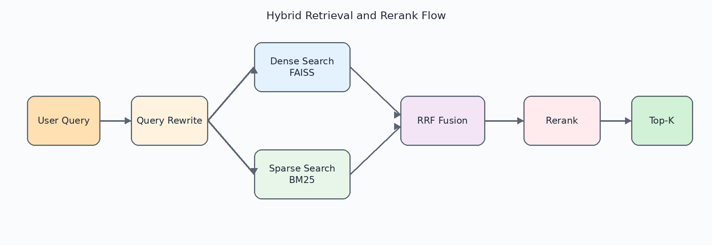
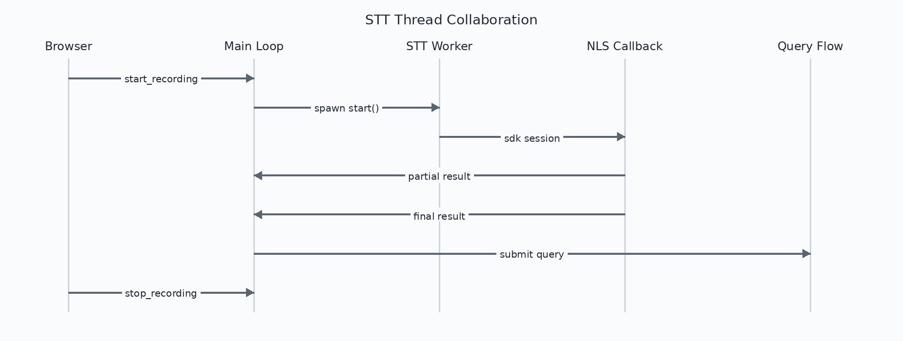
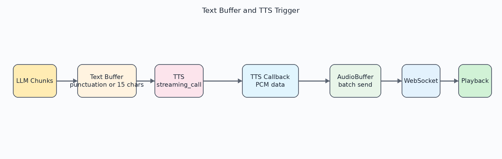
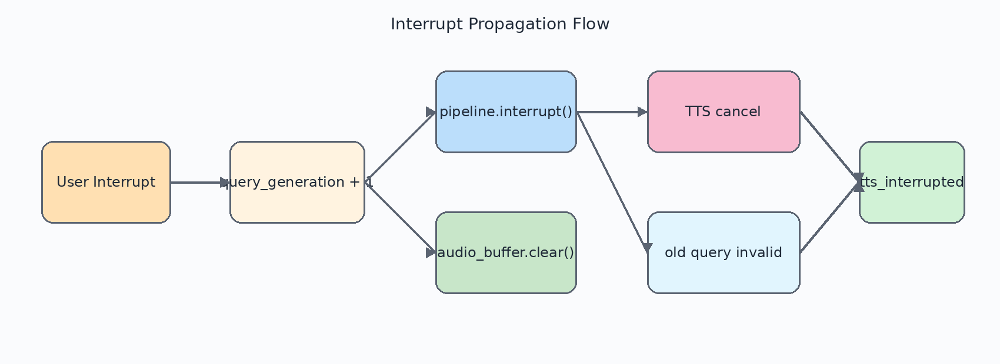

# 第四章 系统实现

本章在第三章设计方案的基础上，说明项目的具体实现方式。为了保证结构一致性，本文按照 RAG 检索模块、STT 语音识别模块、LLM 推理模块、TTS 语音合成模块以及会话编排与服务接入模块五个部分展开，其中浏览器通信接入与会话控制能力统一纳入会话编排与服务接入模块进行说明。

## 4.1 系统总体实现

### 4.1.1 开发环境与技术选型

本项目以后端 Python 3.10 与前端原生 JavaScript 为主要开发环境，后端围绕服务接入、会话编排、检索、识别、生成和合成几个部分组织实现，目标是把浏览器实时音频、知识检索、流式生成和流式合成放在同一条可控链路中完成。前端保持轻量化实现，录音、播放和状态展示都直接依赖浏览器原生能力，这样更便于把音频采集、缓冲和打断控制收敛到同一套会话逻辑中。

表 4.1 给出了实现环境与关键依赖。与传统 Web 应用不同，本项目的依赖选择不仅取决于通用开发效率，还受到流式语音、文档处理和检索增强三类任务的共同影响。例如，OCR 与版面分析相关依赖用于复杂文档抽取，向量检索与稀疏检索相关依赖用于混合检索，而模型接口相关依赖则承担语言模型、向量化、重排序与语音合成能力调用。

表 4.1 实现环境与关键依赖

| 类别 | 名称 | 版本或说明 | 用途 |
| --- | --- | --- | --- |
| 操作系统 | Ubuntu（WSL2） | 22.04 | 开发与测试环境 |
| 后端语言 | Python | 3.10 | 后端服务与脚本实现 |
| Web 框架 | FastAPI | 0.104+ | 浏览器接入与异步服务 |
| ASGI 服务器 | uvicorn | 0.24+ | 本地运行与调试 |
| 向量检索 | faiss-cpu | 1.7.4+ | 稠密向量检索 |
| 稀疏检索 | jieba + rank_bm25 | 0.42 / 0.2 | 中文分词与 BM25 检索 |
| 文档处理 | paddlepaddle + paddleocr | 3.0.0 / 3.4.3 | PDF 文字提取与 OCR |
| 模型接口 | openai + dashscope | 1.12+ / 1.17+ | LLM、Embedding、Rerank、TTS |

在云服务选择方面，本项目将语音识别、语言模型、向量化、重排序和语音合成都接入阿里云相关服务体系，并通过统一的配置层进行管理。这样做的直接结果是：查询改写、检索、生成和合成虽然分别调用不同 SDK，但它们都在同一套配置和日志体系下运行，便于后续排查请求链路中的异常位置。

### 4.1.2 系统总体架构

系统总体架构如图 4.1 所示。浏览器前端负责录音、文本输入、状态展示与语音播放；后端服务负责会话状态控制、业务模块调度和模型接口组织；云端服务负责语音识别、语言模型推理、向量化和语音合成等能力输出；本地磁盘则保存知识库索引、文档元数据和测试数据。这样的划分使后端编排层可以在不暴露底层 SDK 细节的前提下，统一串起 STT、RAG、LLM 和 TTS 四个能力。

这一架构安排的关键点在于把“知识依据”和“生成能力”分离开：本地只负责文档索引、候选召回和来源恢复，云端只负责语言理解、流式生成与语音合成。这样一来，生成模型的输入始终由检索结果约束，最终回答也可以直接回溯到本地知识库中的具体片段。

### 4.1.3 模块划分与功能职责

后端实现遵循第三章给出的五模块划分方式，模块依赖关系如图 4.2 所示。检索模块以 `DocumentStore` 为核心，负责文档加载、索引构建和在线检索；语音识别模块负责实时识别与鉴权维护；语言模型模块负责流式输出回答；语音合成模块负责把文本片段转成 PCM 音频；会话编排与服务接入模块则承担浏览器接入、状态维护和消息路由职责。

在这一划分方式下，浏览器接入层只负责 WebSocket 连接和消息收发，真正的流程控制集中在后端会话编排层中。这样既能保留模块边界，也能把打断、缓冲和历史维护等状态逻辑统一收束到一个可追踪的实现入口里。

### 4.1.4 端到端处理流程

一次完整语音问答的处理流程如图 4.3 所示。用户在浏览器端启动录音后，前端通过 WebSocket 持续上传音频分片；语音识别模块先返回中间识别结果，句子结束后提交最终文本；会话编排层随后启动查询改写和知识检索，再把检索结果连同历史上下文一起交给语言模型；生成阶段输出的文本片段经过缓冲后进入语音合成模块，最终由后端音频缓冲区批量下发到前端播放。

从实现结果看，这一流程仍然遵循“识别、检索、生成、合成、播放”的顺序，但各阶段并不是严格串行等待的。识别结果一旦稳定就会触发后续查询，LLM 的输出片段只要达到缓冲条件就可以进入 TTS，音频又会在后端缓冲后批量发送，因此整条链路的实际等待时间被压缩到了用户可接受的范围内。

## 4.2 RAG 检索模块实现

### 4.2.1 文档预处理

航空维修资料通常包含双栏排版、图表说明、编号列表和复杂页眉页脚，如果直接采用通用文本提取工具，往往会出现阅读顺序错乱、表格内容丢失或章节边界模糊等问题。针对这一特点，本文先把 PDF 页面转成图像，再通过版面分析和 OCR 抽取文字，随后完成清洗、分段和元数据整理。图 4.4 展示了该离线建库流程。

完成文本抽取后，系统会先做基础清洗，再进行段落级切分，过长段落还会继续按句子或字符长度拆分。这样处理的直接目标，是让每个文档片段尽量保持一个相对完整的语义单元，避免把“对象、条件、结论”拆散到不同片段中。

在切分过程中，系统还会同步提取章节标题、小节编号和页码等元数据，并把这些字段与原始 `content` 一起保存。后续无论是来源展示，还是基于章节和页码的过滤检索，都依赖这一套结构化信息。

### 4.2.2 索引构建

知识库索引构建采用统一的离线流程调度。系统先把文档片段转换为向量表示，再完成归一化并写入向量索引；随后基于同一批片段构建 BM25 稀疏索引。这样做的好处是，向量索引、BM25 索引和文档元数据都以同一套文档片段为基础，启动时加载和运行时检索都能保持一致。

最终落盘时，系统会把 FAISS 索引、文档元数据文件和 BM25 相关文件一起保存到本地索引目录中。这样在服务启动阶段只需一次加载，就能恢复完整检索能力，而不必重新扫描原始知识库。

### 4.2.3 混合检索与重排序

在线检索阶段，会话编排层会先执行查询改写，再进入 `DocumentStore` 完成在线检索。检索模块内部先执行稠密检索与稀疏检索，再通过倒数排名融合方法完成排序整合。图 4.5 给出了这条链路的顺序关系。

在召回阶段之后，系统会先扩大候选集合，再交给重排序模型做二次排序。这个过程的重点不是简单扩大候选数量，而是先保证召回，再把最相关的片段推到前列，减少语言模型上下文中的噪声片段。

## 4.3 STT 语音识别模块实现

### 4.3.1 NLS Token 管理

语音识别服务采用动态 Token 鉴权机制，因此系统必须在长时间运行过程中维护有效的身份凭证。识别模块会先检查当前 Token 是否还在安全有效期内，若距离过期不足一定阈值，就重新申请新 Token。这个缓存逻辑把鉴权刷新和识别会话解耦开，避免每次开启识别都重复走一次完整的鉴权流程。

当新的识别会话启动时，识别器只需要取得当前可用 Token 并建立语音转写会话，识别回调和音频传输流程就可以专注于音频本身，不再掺杂鉴权细节。

### 4.3.2 流式识别与线程隔离

流式识别模块负责启动识别会话、持续送入音频分片、接收中间结果和最终结果，并在用户结束讲话后及时关闭当前识别过程。由于第三方识别服务的连接建立、停止和回调处理都带有阻塞特征，系统把这些操作放进独立线程执行，而主事件循环本身只负责收发 WebSocket 消息和调度回调。

在实现层面，识别模块增加了线程安全的最终结果交付控制。中间识别结果和最终识别结果分开处理，显式停止时还会再做一次最终结果确认。这样既避免了 SDK 回调与主动停止同时到达时的重复提交，也让后续查询处理可以直接依赖唯一的最终文本。

## 4.4 LLM 推理模块实现

### 4.4.1 流式生成实现

在语言模型实现阶段，系统通过流式接口逐片段返回文本。会话编排层在消费这些片段时，一方面立即回传前端显示，另一方面把片段累积到缓冲区中，等待满足合成条件后再交给 TTS。

这种实现方式的核心不在于“模型是否流式”，而在于“文本片段如何同时服务于前端显示和语音播报”。当 chunk 触发句读标记，或者缓冲长度达到阈值时，系统才把当前片段送入 TTS，从而避免逐 token 合成导致的碎片化问题。

### 4.4.2 提示模板设计

本项目中的语言模型面向的是专业问答与语音播报场景，因此提示模板的目标是限制回答边界、保证输出可朗读并减少无依据扩展。系统提示明确要求回答内容以检索证据为依据，回答长度控制在 3 到 5 句以内，并在涉及安全关键操作时提示以官方维修手册为准。

此外，系统会把检索片段格式化为“参考资料”后拼接进提示上下文，历史对话也会一并传入。这样组织上下文后，模型既能看到当前问题，也能看到最近的对话语境，便于处理指代、省略和追问。

## 4.5 TTS 语音合成模块实现

### 4.5.1 双向流式合成

语音合成模块采用双向流式合成能力。系统在开始播报前先建立合成会话，随后把缓冲后的文本片段分批送入合成服务。这个流程和 LLM 的流式输出天然匹配，因此可以形成“边生成、边合成、边回传”的连续链路。

从实现结果看，合成模块返回的是 22050 Hz 单声道 PCM 音频数据。这个参数会直接影响前端播放调度、缓冲长度和音频拼接方式，因此后端必须按照固定批量进行聚合后再发送。

### 4.5.2 航空型号数字预处理

航空维修场景中存在大量型号、部件号和编号表达，例如机型代号、检查项目编号和章节序号。如果直接将这些文本送入合成模型，往往会出现不符合专业口语习惯的读法。为此，系统会先把常见“字母 + 数字”组合展开，再把后缀中的字母或数字逐位读出，使最终播报更接近维修人员的日常表达习惯。

这一步预处理虽然只是局部细节，但它直接影响用户对回答专业性的感知。只要关键型号和编号读法自然，用户就更容易接受整段播报结果。

### 4.5.3 跨线程音频投递

语音合成 SDK 的音频回调并不运行在主事件循环中，而是由其内部 I/O 线程主动触发。系统会先把 PCM 数据线程安全地转交给主事件循环，再由音频缓冲区负责聚合、编码和下行发送。

前文图 4.7 已经展示了文本片段、TTS 回调、音频缓冲和 WebSocket 下发之间的关系。

这里采用“多线程产生音频、单线程组织发送”的边界划分，目的是把异常处理、状态判断和打断控制都集中到主流程中，避免回调线程直接参与网络发送。

## 4.6 会话编排与服务接入模块实现

### 4.6.1 会话建立与消息接入

服务接入层通过统一的 WebSocket 端点接收浏览器上传的音频分片、文本问题和控制指令，并为每个连接维护独立的会话状态。音频批量发送由后端缓冲区负责，二者共同构成浏览器和后端之间的实时双向通道。开始录音、结束录音、直接文本提问和中途打断虽然表现为不同消息类型，但它们在后端都被映射为一次会话状态变化。

因此，本项目把 WebSocket 作为通信承载机制，由服务接入层接收外部输入，再把会话语义交给编排层统一处理。这样浏览器通信细节可以被收敛在接入层内部，核心模块只需要关注自己的输入和输出。

### 4.6.2 查询编排与上下文维护

会话编排模块负责在识别结果稳定后启动查询改写、知识检索、语言模型生成和语音合成，并把各阶段产生的中间结果交给前端展示或播放。其中，`VoiceChatPipeline` 承担了整条链路的核心编排职责：它先触发查询改写，再执行 RAG 检索，随后启动 LLM 流式生成和 TTS 片段合成。

为了支持多轮对话，编排模块还维护有限长度的历史问答记录，只保留最近若干轮上下文。这样一方面可以补足代词、省略和追问中的语义信息，另一方面也能避免上下文过长带来的调用成本上升。

### 4.6.3 文本缓冲、音频批量发送与打断控制

在流式链路中，若把语言模型输出的每个极短文本片段都立即送入语音合成模块，往往会造成发音破碎；但若等待整段回答完全生成后再统一合成，又会失去流式处理带来的实时性优势。为解决这个问题，编排层在 LLM 和 TTS 之间增加了文本缓冲机制：当缓冲文本遇到句号、问号、分号、换行，或者累计长度达到约 15 个字符时，再一次性送入语音合成模块。

在音频下行阶段，服务接入层还增加了音频批量缓冲能力。语音合成回调产生的音频片段通常较小，如果逐片发送，会带来较高的消息频率和前端处理开销；因此，系统会先在后端将多个小片段合并，再以较稳定的批次发送给浏览器。

打断控制则是本模块实现中的另一项重点。用户在播报过程中发起新的输入后，系统需要同时终止旧的语言模型输出、停止旧的语音合成、清空未发送音频，并使浏览器状态切回可接收新问题的模式。打断指令到达后，服务端会先更新当前会话代次，使旧请求失效；随后统一触发回答终止、清空待发送音频，并向前端发送“当前播报已中断”的状态通知。图 4.8 展示了这一传播过程的关键节点。

## 4.7 本章小结

本章围绕第三章提出的五模块设计，依次说明了项目的具体实现方式。RAG 检索模块通过版面分析、OCR、文档切分、混合检索与重排序构建可靠的知识支撑；STT 模块通过鉴权管理与线程隔离实现稳定的实时识别；LLM 模块通过受上下文约束的流式生成形成可播报回答；TTS 模块通过双向流式合成、文本预处理和跨线程投递完成语音输出；会话编排与服务接入模块则把浏览器接入、状态维护、文本缓冲、音频批量发送和打断控制统一组织起来。至此，系统设计中的模块边界已经在实现层面得到完整对应，为后续优化和测试分析奠定了基础。
